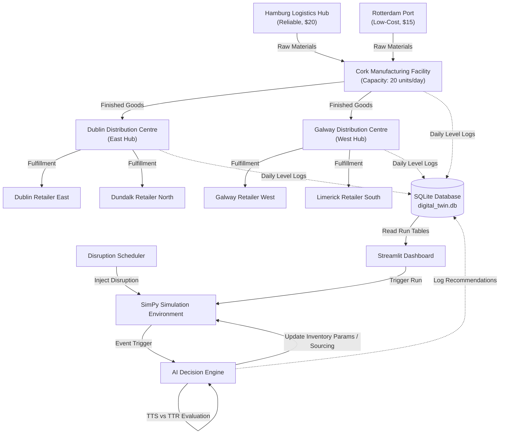

# Architecture & Data Flow

This document details the system architecture and data flow for the **AI Supply Chain Digital Twin**.

## System Overview

The system is designed as a closed-loop discrete-event simulation model integrated with an analytical AI Decision Engine and a visualization layer.

## Component Architecture

1. **Discrete-Event Simulation (SimPy)**:
   * **Nodes**: Modelled as logical processes with inventory capacity (`simpy.Container`).
   * **Orders**: Modelled as dynamic requests. Customers place daily orders. Warehouses place $(s, S)$ orders to the Factory, which backlogs if inventory is insufficient.
   * **Shipments**: Running processes that consume transit time (scaled by distance and mode) and trigger costs.

2. **Disruption Scheduler (`digital_twin/simulation.py`)**:
   * Runs concurrent processes in SimPy (`disruption_scheduler` and `run_single_disruption`) to inject disruptions (Port closures, supplier failures, winter storms, demand surges) at set times.
   * Disruption states modify lead times, breakdown probabilities, or customer demand multipliers.

3. **AI Decision Engine (`digital_twin/ai_engine.py`)**:
   * Triggers whenever a disruption is initialized.
   * Calculates **Time-to-Survive (TTS)** (inventory divided by average consumption) and compares it to the **Time-to-Recovery (TTR)**.
   * Evaluates the cost-benefit trade-offs of alternatives (e.g., dual-sourcing premiums vs. production outage losses).
   * Recommends actions and updates SimPy parameter states dynamically if mitigation is enabled.

4. **Database Event Ledger (`digital_twin/database.py` & SQLite)**:
   * Serves as the central logging mechanism. Since SimPy environments run instantly in memory, the SQL ledger provides persistent state tracking.
   * Allows comparisons between distinct scenario types (`baseline`, `disrupted`, `mitigated`) under identical parameters.

5. **Streamlit Analytics Dashboard (`app.py`)**:
   * Uses Plotly to draw geospatial supply chain graphs (nodes and transit lines) dynamically based on current disruption states.
   * Computes logistics KPIs (service level, fill rate, costs, stockouts) from raw database tables.
   * Presents the AI mitigation reasoning cards side-by-side with charts.
